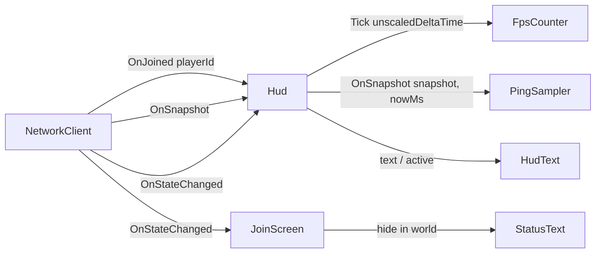

# Technical Design: Client HUD — FPS & Ping

## Overview
- **What:** a two-line HUD at the top-left of the Unity client, showing `FPS: N` and `Ping: N ms`, visible only while `InWorld`.
- **FPS:** frames counted over ~0.5 s windows of unscaled time.
- **Ping:** derived from the existing `t0` echo. When a snapshot carries a new `seq` for the local player, `ping = now − t0`. No protocol or server change.
- **Code shape:** the logic lives in two plain C# classes (`FpsCounter`, `PingSampler`) covered by EditMode tests. A thin `Hud` MonoBehaviour wires them to `NetworkClient` events and a uGUI `Text`.

Requirements: [`REQUIREMENTS-hud.md`](REQUIREMENTS-hud.md).

## Context & constraints
- **`t0` echo:** `SnapshotPlayer` carries the `seq` and `t0` of the player's latest accepted input (`dumb-server/crates/protocol/src/messages.rs:33-45`, Unity `ServerPlayer` in `Protocol.cs:45-56`). `t0` is stamped by `NetworkClient.SetInput` with `DateTimeOffset.UtcNow.ToUnixTimeMilliseconds()` (`NetworkClient.cs:65`).
- **Input cadence:** `MovementInput` sends on every direction change and resends every 100 ms while `InWorld`, idle included (`MovementInput.cs:28`). A fresh `seq` therefore comes back about every 100 ms.
- **What ping measures:** uplink + wait for the next 20 Hz tick (0–50 ms) + downlink + up to one client frame. `NetworkClient` raises `OnSnapshot` from `Update` on the main thread (`NetworkClient.cs:72-75`). This bias is accepted by the requirements.
- **Netsim:** it delays data frames only (`ingest.rs`, `writer.rs`), so inputs and snapshots carry the simulated latency. Start it with `$env:LATENCY_MS='100'; cargo run --release -p server` (README:160).
- **Event pattern to copy:** `ZoneView` and `JoinScreen` subscribe in `OnEnable` and unsubscribe in `OnDisable`, and take a `[SerializeField] NetworkClient client`.
- **UI:** uGUI legacy `Text` (built-in font `fileID: 10102`) on `JoinCanvas`: Screen Space Overlay, `CanvasScaler` scale-with-screen at 1920×1080, match width (`Demo.unity:270-290`).
- **Top-left conflict:** `StatusText` is a child of `JoinCanvas` (not `JoinPanel`), anchored top-left at `(20, -20)`, 900×40, 28 px. `JoinScreen.ShowState` only toggles `panel`, so today it stays visible in world, showing `InWorld`. **Decision:** hide `StatusText` while `InWorld`, and the HUD takes that slot.
- **Assemblies:** runtime scripts are in `Assets/Scripts/Demo.asmdef`, tests in `Assets/Tests/EditMode/Demo.Tests.EditMode.asmdef`, and everything is in the `Demo` namespace.
- **Out of scope:** `ping`/`pong` messages, server changes, ping smoothing, color thresholds, a toggle key.

## Architecture



| Component | Owns | Why separate |
|---|---|---|
| `FpsCounter` (plain C#) | Frame count and elapsed time in the current window, last `Fps` | Pure logic; testable with fake `dt` |
| `PingSampler` (plain C#) | Local player id, last sampled `seq`, last `PingMs` | Pure logic; covers the seq/stale edge cases without Unity |
| `Hud` (MonoBehaviour) | Event subscriptions, visibility, formatting to `Text` | Keeps Unity coupling in one thin place; nothing else depends on it |
| `JoinScreen` (existing) | Also hides `StatusText` while `InWorld` | It already owns `statusText` |

## Data models & interfaces

### `Assets/Scripts/UI/FpsCounter.cs`
```csharp
public class FpsCounter
{
    public FpsCounter(float windowSeconds = 0.5f);
    public int Fps { get; }            // 0 until the first window completes
    /// Adds one frame. Returns true when a window completed and Fps changed value.
    public bool Tick(float unscaledDeltaTime);
    public void Reset();
}
```
- `Tick`: `frames++; elapsed += dt;`. If `elapsed ≥ window`, then `next = Mathf.RoundToInt(frames / elapsed)`, `frames = 0`, `elapsed = 0`, and it returns `next != Fps` after assigning. The caller rewrites text only on `true`.
- **Why frames/elapsed rather than a mean of `1/dt`:** it is the true average rate, and a single long frame doesn't skew it the way averaged reciprocals do.

### `Assets/Scripts/UI/PingSampler.cs`
```csharp
public class PingSampler
{
    public long? PingMs { get; }       // null = no sample yet ("--")
    public void SetLocalPlayer(long playerId);   // also clears PingMs and lastSeq
    public void Reset();                          // playerId = -1, clears PingMs and lastSeq
    /// Returns true when PingMs changed value.
    public bool OnSnapshot(ServerSnapshot snapshot, long nowMs);
}
```
- `OnSnapshot`:
  1. If `playerId < 0` or `snapshot.players == null`, return false.
  2. Find the entry with `id == playerId`. If there is none, return false (keep the last value).
  3. If `entry.seq <= lastSeq`, return false. This means no input has been acked yet (`seq 0`) or it is a repeat of an already-sampled `t0`.
  4. `lastSeq = entry.seq`, `next = Math.Max(0, nowMs − entry.t0)`, and return `next != PingMs` after assigning.
- `lastSeq` starts at `0`, so the server's pre-input `seq 0` / `t0 0` never produces a sample. Otherwise the first sample would read as ~1.7 × 10¹² ms.
- `Math.Max(0, …)` guards against a system-clock step backwards making ping negative.
- The linear scan over ≤150 players runs at 20 Hz, which is negligible.

### `Assets/Scripts/UI/Hud.cs`
```csharp
public class Hud : MonoBehaviour
{
    [SerializeField] private NetworkClient client;
    [SerializeField] private Text text;
}
```
- **`Awake`:** calls `ShowState(client.CurrentState)`.
- **`OnEnable` / `OnDisable`:** subscribes and unsubscribes `OnJoined`, `OnSnapshot` and `OnStateChanged`.
- **`OnJoined(joined)`:** `ping.SetLocalPlayer(joined.playerId)`, `fps.Reset()`, `Render()`.
- **`OnSnapshot(s)`:** if `ping.OnSnapshot(s, DateTimeOffset.UtcNow.ToUnixTimeMilliseconds())` returns true, `Render()`.
- **`OnStateChanged(state)` → `ShowState`:** `text.gameObject.SetActive(state == InWorld)`. On leaving `InWorld`, `ping.Reset()`.
- **`Update`:** if the text is active and `fps.Tick(Time.unscaledDeltaTime)` returns true, `Render()`.
- **`Render`:** `text.text = $"FPS: {fps.Fps}\nPing: {(ping.PingMs?.ToString() ?? "--")} ms"`. It allocates only when a value changed: at most about 2/s for FPS and 10/s for ping.
- **Visibility is derived from `NetworkClient.State`,** which is already an FSM, so the HUD has no state of its own that could disagree.
- **Hiding the text only:** `Hud` stays enabled, and only the text object is toggled, so `Hud` keeps receiving events.

### `JoinScreen.cs` change
Add to `ShowState`:
```csharp
statusText.gameObject.SetActive(state != NetworkClient.State.InWorld);
```

### Scene `Demo.unity` (via Unity MCP)
- **New GameObject `HudText`**, a child of `JoinCanvas`, with `Text`:
  - built-in font, 28 px, white, upper-left alignment;
  - `raycastTarget = false`;
  - horizontal and vertical overflow set to overflow.
- **`HudText` RectTransform:** anchor and pivot `(0, 1)`, position `(20, -20)`, size `(400, 80)`. This matches `StatusText`.
- **`Hud` component on `DemoNet`:** `client` set to `DemoNet`'s `NetworkClient`, `text` set to `HudText`.

## Implementation plan
1. **Before screenshot.** Enter play mode, join a localhost server, capture `docs/screenshots/hud-before.png`. `StatusText` shows `InWorld` top-left, and there is no HUD.
2. **`FpsCounter` + tests.** Add `Assets/Scripts/UI/FpsCounter.cs` and `Assets/Tests/EditMode/FpsCounterTests.cs`. EditMode green.
3. **`PingSampler` + tests.** Add `Assets/Scripts/UI/PingSampler.cs` and `Assets/Tests/EditMode/PingSamplerTests.cs`. EditMode green.
4. **Wire in.**
   - Add `Assets/Scripts/UI/Hud.cs`.
   - Add the `JoinScreen.ShowState` line.
   - Create `HudText` and the `Hud` component in `Demo.unity` via MCP, then save the scene.
   - EditMode green, and the console has no errors on entering play mode.
5. **Acceptance run.**
   - Netsim off: join, capture `hud-after.png`, and run the FPS and ping checks (see Testing).
   - Restart the server with `LATENCY_MS=100`, rejoin, capture `hud-after-latency100.png`, and run the ping check.
   - Disconnect and rejoin, then check visibility and the `--` reset.
   - Run `cargo test` to confirm the server is untouched.

## Testing & verification

| Acceptance criterion | Verified by |
|---|---|
| HUD hidden when not `InWorld` | Play mode: before joining and after stopping the server, read `HudText.activeSelf == false` via `execute_code`; the screenshot shows the join panel with no HUD. |
| HUD top-left, no overlap | `hud-after.png` shows the two lines top-left, and `StatusText.activeSelf == false` in world (read via `execute_code`). |
| FPS within ±10% | Play mode: an `execute_code` hook on `Application.onBeforeRender` records `Time.unscaledDeltaTime` for 5 s (same method as `demo-run.md` Run 2). At each HUD refresh, compare the parsed `HudText` FPS against `frames/sum(dt)` over the preceding 0.5 s. Pass = every comparison within ±10%. EditMode `FpsCounter_ConstantDt_ReportsRate` (dt = 1/144 → 144), `FpsCounter_ReportsOnlyAfterWindow`, `FpsCounter_MixedFrames_UsesFramesOverElapsed`. |
| Ping 0–60 ms with netsim off, updating | Play mode, 5 s in world: sample `HudText.text` every 0.5 s. Every sample after the first second parses to 0–60, and the values are not all `--`. |
| Ping 100–175 ms at `LATENCY_MS=100` | Same sampler after restarting the server with `$env:LATENCY_MS='100'`. Every sample after the first second is 100–175. |
| Samples only on new `seq` | EditMode `PingSampler_RepeatedSeq_SamplesOnce`: seq 5 at now=1100 with t0=1000 gives 100; seq 5 again at now=1300 still gives 100 and returns false. |
| No entry / no sample yet keeps value | EditMode `PingSampler_NoLocalEntry_KeepsLast`, `PingSampler_BeforeJoin_Null`, `PingSampler_SeqZero_NoSample` (server pre-input `seq 0, t0 0`). |
| Rejoin resets to `--` | EditMode `PingSampler_SetLocalPlayer_ClearsPing`. Play mode: stop and restart the server, rejoin, and the first `HudText.text` read after join contains `Ping: -- ms`, or a fresh value within 1 s. |
| Screenshots; existing tests pass | `hud-before.png`, `hud-after.png`, `hud-after-latency100.png` in `docs/screenshots/`; all EditMode tests and `cargo test` green. |

Extra edge cases:
- **Clock stepping backwards** (`t0 > nowMs`): `PingSampler_NegativeDelta_ClampsToZero`.
- **Snapshot before `joined`** (the `ZoneView.cs:68` race): the `playerId < 0` check means no sample. Covered by `PingSampler_BeforeJoin_Null`.

## Open questions / risks
- **MCP screenshots of overlay UI:** earlier tasks (T6.1 onward) captured Screen Space Overlay canvases in play-mode screenshots, so no fallback should be needed. If capture ever misses the HUD, prove the text from `execute_code` reads.
- **Editor FPS vs build FPS:** play mode in the editor runs slower than the standalone build and may be throttled when unfocused. The ±10% check compares the HUD against the same process's frame times, so it holds either way.
