# Technical Design: Network Simulation — Latency & Jitter

## Overview
This adds a server-side network simulator that delays each connection's WebSocket data frames in both directions. The settings are two env vars, `LATENCY_MS` and `JITTER_MS`. A small generic `DelayQueue<T>` in a new `netsim.rs` holds frames until their release time. The per-connection `writer` uses it before `sink.send`, and `ingest` uses it before parsing. When both values are 0, both loops skip the queue, so the baseline path is unchanged.
Requirements: [`REQUIREMENTS-netsim.md`](REQUIREMENTS-netsim.md).

## Context & constraints
- **Connection plumbing** (`dumb-server/crates/server/src/http.rs:41-47`): `connect()` splits the socket and spawns `writer::run` and `ingest::run`. Today it receives only `ZoneHandle`.
- **Outbound choke point** (`writer.rs:27-52`): a `select!` over the unicast `mpsc` and the zone `broadcast`, then `sink.send(frame)`. The broadcast buffer is **4** (`zone.rs:23`). If the writer stops pulling while frames wait, it gets `Lagged` and skips snapshots. So the writer must keep draining the channel into the delay queue.
- **Inbound choke point** (`ingest.rs:22-60`): `stream.next()`, then parse, validate, and `events.send`. Ending ingest drops `unicast_tx`, which lets the writer flush and report `Closed` (`ingest.rs:1-5`).
- **Config** (`config.rs`): env vars through the private `env_parse` (unparseable → default), plus a startup `log()`. There are three `Config { .. }` literals: `zone.rs:276` (test helper), `tests/echo.rs:10`, `tests/common/mod.rs:26`.
- **Router call sites:** `main.rs:49`, `tests/echo.rs:20`, `tests/common/mod.rs:36`.
- **Dependencies:** tokio already has the `time` feature, and `test-util` is in dev-deps, so paused-time tests work. There is no RNG crate. `rand` is only transitive via sqlx, and we won't add one.
- **Measurement:** the bot `t0` echo covers uplink(A) + tick wait + downlink(B) (`bot/src/bot.rs:101`, `report.rs`).
- **Out of scope** (from the requirements):
  - per-connection or runtime settings
  - separate up/down settings
  - loss, reordering, or bandwidth limits
  - delaying control frames
  - Unity changes

## Architecture

```mermaid
flowchart LR
  subgraph conn[Per connection]
    S[(WebSocket stream)] -->|Text/Binary| IQ[DelayQueue&lt;Message&gt; uplink]
    IQ -->|due| H[ingest::handle]
    H -->|ClientEvent| Z[Zone]
    Z -->|broadcast / unicast| W[writer select!]
    W -->|encoded Message| OQ[DelayQueue&lt;Message&gt; downlink]
    OQ -->|due| K[(WebSocket sink)]
  end
  C[Config.net_sim] --> R[http::router state] --> conn
```



| Component | Owns | Why it's separate |
|---|---|---|
| `netsim.rs`: `NetSim` | The two settings, `is_off()`, and the one-way delay model | One place defines the model, shared by both directions |
| `netsim.rs`: `DelayQueue<T>` | Pending frames, release times, order clamp, RNG | Generic, and unit-testable with paused time without sockets |
| `writer.rs` | Downlink: pulls frames immediately, queues them, sends when due, flushes on close | It already is the single outbound point |
| `ingest.rs` | Uplink: reads frames immediately, queues data frames, handles them when due, drains on stream end | It already is the single inbound point |
| `http.rs` | Passes `NetSim` from the router state into both tasks | Keeps Zone unaware of transport simulation (loose coupling) |

## Data models & interfaces

### `crates/server/src/netsim.rs` (new, `pub mod netsim` in `lib.rs`)
```rust
/// Simulated network conditions. Round-trip figures; each direction gets half.
#[derive(Debug, Clone, Copy, Default, PartialEq, Eq)]
pub struct NetSim {
    /// Added round-trip time, `LATENCY_MS`.
    pub latency_ms: u64,
    /// Max extra random round-trip time, `JITTER_MS`.
    pub jitter_ms: u64,
}

impl NetSim {
    /// True when both values are 0: callers bypass the queue entirely.
    pub fn is_off(self) -> bool;
}

/// Holds items until their release time; never reorders.
pub struct DelayQueue<T> {
    sim: NetSim,
    pending: VecDeque<(tokio::time::Instant, T)>,
    last_release: tokio::time::Instant,
    rng: u64, // SplitMix64 state
}

impl<T> DelayQueue<T> {
    pub fn new(sim: NetSim) -> Self;
    /// Schedule at max(last_release, now + one_way_delay()).
    pub fn push(&mut self, item: T);
    /// Wait until the head is due, then pop it. Pending forever when empty.
    /// Cancel-safe: pops only after the sleep completes, so losing a
    /// `select!` race never drops an item.
    pub async fn next(&mut self) -> T;
    pub fn is_empty(&self) -> bool;
}
```
**Decisions:**
- **One-way delay** = `latency_ms * 500 µs + uniform[0, jitter_ms * 500] µs`. Working in microseconds splits odd values exactly: `LATENCY_MS=101` gives 50.5 ms each way.
- **Order clamp.** `release = max(last_release, now + delay)`. A `last_release` already in the past has no effect, so an idle connection gets the plain `[L/2, L/2+J/2]` delay.
- **RNG.** SplitMix64 seeded once per queue from `std::hash::RandomState::new().build_hasher().finish()`, which gives a random per-process-and-instance seed from the stdlib. Mark it with `// ponytail: SplitMix64, statistical quality irrelevant for jitter; swap to rand if distributions matter`. Uniform draw: `rng % (max + 1)`. The modulo bias is irrelevant here.
- **Clock.** `tokio::time::Instant`/`sleep_until`, so `#[tokio::test(start_paused = true)]` drives it deterministically.
- **Unbounded `VecDeque`.** The requirements say no cap. At 100 ms that is about 3 snapshots per connection. Snapshot frames share the tick's `Arc<[u8]>` (`writer.rs:70`), so queuing copies nothing.

### `config.rs`
```rust
pub struct Config {
    // ...existing fields...
    /// Simulated latency/jitter, `LATENCY_MS` / `JITTER_MS` (default 0/0 = off).
    pub net_sim: NetSim,
}
// from_env():
net_sim: NetSim {
    latency_ms: env_parse("LATENCY_MS", 0),
    jitter_ms: env_parse("JITTER_MS", 0),
},
```
- `-5` and `abc` both fail to parse as `u64`, so they fall back to `0`. That matches the requirement.
- `log()` adds `latency_ms` and `jitter_ms` fields. If `!net_sim.is_off()`, it adds `tracing::warn!(latency_ms, jitter_ms, "network simulation active: all connections delayed")`.
- The three test literals add `net_sim: NetSim::default()`.

### `http.rs`
```rust
pub fn router(zone: ZoneHandle, net_sim: NetSim) -> Router  // state: (ZoneHandle, NetSim)
async fn connect(socket: WebSocket, zone: ZoneHandle, net_sim: NetSim)
// spawns writer::run(.., net_sim) and ingest::run(.., net_sim)
```
`/health` and `/metrics` extract `State((zone, _))` or equivalent. Their behavior is unchanged.

### `writer.rs`: new trailing parameter `net_sim: NetSim`
Behavior:
1. Create `let mut downlink = DelayQueue::new(net_sim);`.
2. Add a `select!` branch `frame = downlink.next() => send(frame)`. On a send error, it stops (dead socket, no flush).
3. The existing unicast and broadcast branches produce `Option<Message>` as today. Then:
   - if `net_sim.is_off()`, send immediately (current behavior)
   - otherwise `downlink.push(frame)`
4. The subscription to broadcasts still happens when the `joined` reply is *pulled*. `joined` is pushed first, so it is still the first frame released.
5. **When unicast ends** (`recv()` → `None`, meaning ingest has finished): leave the loop, then `while !downlink.is_empty() { send(downlink.next().await) }` (stop on a send error). After that, report `Closed` and close the sink, as today.
6. **When the broadcast closes** (Zone stopped): leave the loop and flush the same way. It is harmless and keeps a single exit path.

### `ingest.rs`: new trailing parameter `net_sim: NetSim`
The per-frame body (`ingest.rs:23-59`) moves into a helper:
```rust
enum Flow { Continue, Stop }
async fn handle(text: Utf8Bytes, state: &mut Ingest) -> Flow
// Ingest { events, unicast_tx, player_id_rx, join_sent }
```
Loop:
- `select!` over `stream.next()` and `uplink.next()`.
  - `Some(Ok(Message::Text(t)))`: if `net_sim.is_off()`, call `handle(t)` right away. Otherwise push `t` into `uplink`.
  - `Some(Ok(Message::Binary | Ping | Pong))`: skip. This is today's `_ => continue`. axum answers pings itself.
  - `Some(Ok(Message::Close(_)))`, `Some(Err(_))`, `None`: stop reading. This is a control frame or the end of the stream, and it is not delayed.
  - `t = uplink.next()`: call `handle(t)`. `Flow::Stop` (a `leave`, or the zone stopped) returns immediately and drops anything queued after it.
- **After the reading ends:** `while !uplink.is_empty()`, handle `uplink.next().await`, and stop on `Flow::Stop`. Then return. This drops `unicast_tx`, and the writer flushes (see above).

The uplink queue holds `Utf8Bytes`, not `Message`, because only text frames are data today. Binary frames are skipped now and stay skipped.

### Test helper (`tests/common/mod.rs`)
```rust
pub async fn start_server(pool: Option<MySqlPool>) -> String  // unchanged: start_server_with(pool, NetSim::default())
pub async fn start_server_with(pool: Option<MySqlPool>, net_sim: NetSim) -> String
```

### Deployment surface
- `README.md` "Server configuration" table gets two rows:
  - `LATENCY_MS | 0 | Added round-trip ms (half each direction)`
  - `JITTER_MS | 0 | Max extra random round-trip ms; order preserved`
- `docker/docker-compose.yml` `server.environment` gets `LATENCY_MS: "0"` and `JITTER_MS: "0"`.

## Implementation plan
1. **`netsim.rs` core.**
   - Add `NetSim`, `DelayQueue<T>` and SplitMix64, plus `pub mod netsim;` in `lib.rs`.
   - Add the unit tests (see Testing).
   - Nothing else references it yet.
2. **Config.**
   - Add the `net_sim` field, parse it in `from_env`, and log/warn in `log()`.
   - Update the three `Config` literals (`zone.rs:276`, `tests/echo.rs:10`, `tests/common/mod.rs:26`).
   - Update the README table and `docker-compose.yml`.
   - `cargo test` stays green.
3. **Wiring.**
   - Change `router(zone, net_sim)` and `connect(.., net_sim)`, and pass `net_sim` to `writer::run` / `ingest::run` as a new parameter (unused until steps 4–5; the two signatures change here).
   - Update `main.rs:49` (`router(zone, config.net_sim)`), `tests/echo.rs:20`, and `tests/common/mod.rs` (`start_server_with`).
   - `cargo test` stays green.
4. **Writer downlink.** Implement the queue branch, the bypass and the flush-on-unicast-end (from the `writer.rs` section). `cargo test` stays green with the default `NetSim`.
5. **Ingest uplink.** Extract `handle`, add the select, bypass and drain (from the `ingest.rs` section). `cargo test` stays green.
6. **E2E tests.** Add `tests/netsim_e2e.rs` (see Testing).
7. **Acceptance run.**
   - Do a release build, then two 150-bot runs of 60 s in the same session: `0/0`, then `100/40`.
   - Check the effective-config and warning logs, including one start with `LATENCY_MS=abc`.
   - Record both reports and the pass/fail against the requirements in `docs/demo-run.md` as "Run 3".

## Testing & verification

| Acceptance criterion | Verified by |
|---|---|
| 0/0 means no delay, existing tests pass | Every existing `cargo test` passes after steps 2–5. The bypass path is covered by all existing e2e tests. |
| `joined` ≥ 200 ms at 200/0 | `netsim_e2e.rs::joined_reply_delayed_by_round_trip`: `start_server_with(None, {200, 0})`, time from `join` send to `joined` receive ≥ 200 ms (and < `TIMEOUT` 2 s). |
| Single-frame delay within `[L/2, L/2+J/2]` | `netsim.rs::delay_within_bounds` (paused): `{100, 40}`, 200 iterations of push → `next()` → elapsed ∈ [50 ms, 70 ms]. |
| Order preserved under large jitter | `netsim.rs::preserves_order_under_jitter` (paused): `{0, 1000}`, push 0..1000 at the same instant, collect → equals 0..1000. |
| Queued frames delivered before close | `netsim_e2e.rs::reply_delivered_after_leave`: `{200, 0}`, client sends a junk text frame then `leave`. It still receives the `bad_message` error before the server closes. (A client Close frame can't be used: tungstenite 0.29 rejects data frames after reading the peer's Close with `SendAfterClosing`, so queued outbound frames are dropped in that case — requirement amended.) |
| Bad env values → 0 | Manual, in step 7: start with `LATENCY_MS=abc JITTER_MS=-5`, and the effective-config log shows `latency_ms=0 jitter_ms=0` with no warning. There is no unit test, because env mutation is `unsafe` in edition 2024 and racy across tests. |
| Warning when active | Manual, in step 7: start with `100/40`, and the warning line appears in the server log (quoted in `demo-run.md`). |
| 150 bots, +100..+150 ms avg, 150/150, 0 drops, ≥ 19 Hz | Step 7 bot runs, both reports in `docs/demo-run.md`. |
| Docs updated | Review of the README table, compose file and `demo-run.md` Run 3. |

Extra unit tests in `netsim.rs`:
- `zero_config_releases_immediately` (paused): elapsed == 0.
- `next_is_cancel_safe` (paused): `timeout(1ms, q.next())` errors at `{100, 0}`, and a later `next()` still yields the item.
- `idle_gap_does_not_accumulate` (paused): push, release, advance 1 s, push → elapsed is again exactly L/2. This checks that a stale `last_release` doesn't add delay.

Run: `cargo test` from `dumb-server/`. DB-backed tests skip unless `TEST_DATABASE_URL` is set.

## Open questions / risks
- **Bot delta includes jitter clamping.** If jitter exceeds frame spacing (50 ms at 20 Hz) the clamp pushes delays upward, but at `J=40` each direction varies by only 20 ms, so no effect is expected. If the run lands above +150 ms, suspect this before suspecting a bug.
- **Very large values (> 1000 ms):** Unity and bot connect/join timeouts have not been investigated (carried over from the requirements). This does not block acceptance.
- **Unity client is not exercised under simulation** by the acceptance criteria. An optional manual check is to connect a Unity client to a `100/40` server and confirm it joins and moves.
