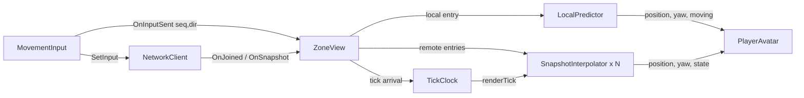

# Technical Design: Client Prediction & Snapshot Interpolation

## Overview
- **Protocol:** the server tells the client its movement rules in `joined` and stamps each snapshot with a `tick`. Each player entry gets an `ageMs`: how long the server has simulated that player's acked input.
- **Local player:** the Unity client predicts its movement every frame and records a history of per-frame steps. On each snapshot it rebuilds its position from the authoritative one plus the steps the server hasn't simulated yet. Any visual error is blended out.
- **Remote players:** rendered a fixed 100 ms in the past, interpolated between buffered snapshots.
- **Code shape:** all logic lives in plain C# classes so EditMode tests can cover it. `ZoneView` stays the thin MonoBehaviour that wires them in.

Requirements: [`REQUIREMENTS-prediction.md`](REQUIREMENTS-prediction.md).

## Context & constraints
- **Server movement** (`dumb-server/crates/server/src/player.rs`):
  - `apply_input` stores a normalized direction.
  - `integrate(dt, speed, world_half)` runs once per tick (`zone.rs` `tick`). It moves by `dir × speed × dt`, where `dt` is the real elapsed time since the last tick, clamps each axis to ±`world_half`, and sets `yaw = atan2(dir_z, dir_x)`.
  - An input that arrives mid-tick is credited with that tick's whole `dt`.
- **Snapshot build:** `Player::snapshot()` → `ServerMsg::Snapshot { players }`, serialized once per tick (`zone.rs:251-263`). `joined` is built in `Zone::admit` (`zone.rs:208`).
- **Places that need `..` once the new fields land:** these match `ServerMsg::Snapshot { players }` or construct it exhaustively.
  - `crates/bot/src/bot.rs:95`
  - `crates/server/tests/common/mod.rs:112`
  - `crates/server/tests/zone_e2e.rs:56`
  - `zone.rs:299` (test)
  - every literal in `crates/protocol/tests/serde.rs`
- **Client input** (`MovementInput.cs`): sends when the direction changes, plus a resend every 100 ms. `NetworkClient.SetInput` assigns `seq = ++seq` (`NetworkClient.cs:56-66`). `seq` resets on `Connect`.
- **Client rendering today** (`ZoneView.cs`): one `Entry` per id, exponential smoothing toward the latest snapshot. `CameraFollow` follows the local avatar's transform.
- **JSON:** `JsonUtility` maps fields 1:1 by camelCase name. A missing field reads as 0.
- **Baseline:** Run 2 in `docs/demo-run.md` measured 142.5 fps with 150 avatars and no netsim. Re-measure under 200/80 before changing anything.
- **Wire examples** live in `docs/TECHNICAL_DESIGN.md:112-113`.
- **Out of scope:** adaptive delay, lag compensation, packet loss, changing the tick/input rates, a HUD, using `playerJoined`/`playerLeft`.

## Architecture



| Component | Owns | Why separate |
|---|---|---|
| `MovementRules` (struct) | speed, worldHalf, tickHz, and `Step(pos, dir, dt)` with clamping | The single client copy of the server rule, shared by prediction and extrapolation |
| `LocalPredictor` | Predicted position and yaw, current input, frame history, visual correction offset | Pure logic; covers the prediction/reconciliation criteria |
| `TickClock` | Sliding-window minimum of `arrival − tick/tickHz`; supplies `RenderTick(now)` | One clock shared by every remote; testable with fake times |
| `SnapshotInterpolator` | A remote's buffered samples plus an FSM: `Interpolating`/`Extrapolating`/`Holding` | Per-remote state; covers the jitter/underrun criteria |
| `ZoneView` (existing, MonoBehaviour) | Registry, spawn/remove, calls the above every frame, applies results to transforms | Keeps Unity coupling in one place |

## Data models & interfaces

### Protocol (Rust `crates/protocol/src/messages.rs`)
```rust
pub struct SnapshotPlayer {
    // ...existing fields...
    /// Milliseconds the server has integrated the current direction, through input `seq`
    /// (sum of tick dt since an accepted input last changed the direction).
    pub age_ms: u64,
}
ServerMsg::Joined { player_id, name, x, z, yaw, speed: f64, world_half: f64, tick_hz: u64 }
ServerMsg::Snapshot { tick: u64, players: Vec<SnapshotPlayer> }
```
Wire:
```json
{"type":"joined","playerId":7,"name":"Bob","x":0.0,"z":0.0,"yaw":1.5708,"speed":5.0,"worldHalf":50.0,"tickHz":20}
{"type":"snapshot","tick":1234,"players":[{"id":7,"name":"Bob","x":12.0,"z":-3.5,"yaw":2.0,"state":"walk","seq":42,"t0":912345,"ageMs":150}]}
```
- **Why `age_ms` is a u64 of ms:** it matches the `t0` convention, and 1 ms of precision is 5 mm at 5 m/s.
- **`tick` source:** a zone-local counter. It starts at 0 when the zone starts and increments once per `tick()`, before serializing.

### Server
- `Player` gains `input_age: f64` (seconds).
  - `apply_input` resets it to `0.0` only when an accepted input changes the direction. Same-direction resends still update `seq`/`t0` but keep the age. (Amended during T3.1: resetting on every accepted `seq` re-anchored the age to the previous tick boundary, 0–50 ms early, on each 100 ms resend. The EditMode steady-walk test measured 0.25 m of reconcile error.)
  - `Zone::tick` adds `dt` for every `Active` player **before** `integrate`, whether or not the player is moving. A stop input still ages, and this keeps age and position credited over the same span.
- `snapshot()` emits `age_ms: (input_age * 1000.0).round() as u64`.
- `Zone` gains `tick: u64` and passes `speed`, `world_half` and `tick_hz` into `Joined`. `Zone` stores `tick_hz`, which `spawn` currently passes only to `run`.

### Unity `Protocol.cs`
- `ServerJoined`: add `public double speed; public double worldHalf; public long tickHz;`.
- `ServerSnapshot`: add `public long tick;`.
- `ServerPlayer`: add `public long ageMs;`.

### `NetworkClient.cs`
`public long SetInput(float vx, float vz)` returns the assigned `seq`, or `-1` when not `InWorld`.

### `MovementInput.cs`
```csharp
[DefaultExecutionOrder(-10)] // send before ZoneView advances prediction in the same frame
public event Action<long, Vector2> OnInputSent;   // (seq, direction), raised after SetInput succeeds
```

### `Assets/Scripts/Game/Prediction/MovementRules.cs`
```csharp
public readonly struct MovementRules
{
    public readonly float Speed, WorldHalf; public readonly int TickHz;
    public MovementRules(ServerJoined joined);
    /// Mirrors player.rs integrate: dir must be normalized or zero.
    public Vector2 Step(Vector2 position, Vector2 direction, float dt);
}
```
Positions are `Vector2 (x, z)` in all logic classes. `ZoneView` maps them to `Vector3(x, 0, z)`.

### `Assets/Scripts/Game/Prediction/LocalPredictor.cs`
```csharp
public class LocalPredictor
{
    public LocalPredictor(MovementRules rules, Vector2 spawn, float yaw, float correctionTime, float snapDistance);
    public Vector2 DisplayPosition { get; }   // predicted + visual offset
    public Vector2 PredictedPosition { get; }
    public float Yaw { get; }                 // radians, server convention atan2(z, x)
    public bool IsMoving { get; }
    public float LastError { get; }           // |reconciled - pre-reconcile predicted|, meters (for logs/tests)
    public bool LastCorrectionSnapped { get; }

    public void SetInput(long seq, Vector2 direction);  // from OnInputSent
    public void Advance(float dt);                      // per frame
    public void Reconcile(long ackSeq, long ageMs, Vector2 serverPosition);
}
```
**Frame history:** a `List<Frame>` where `Frame = (long seq, Vector2 dir, float dt)`. `Advance` appends `(currentSeq, currentDir, dt)`, steps `PredictedPosition`, updates `Yaw` when `dir ≠ 0`, and decays the offset.

**Reconcile algorithm** (amended during T3.1: `ageMs` ages a direction run, not a single seq):
1. Find the first frame with `seq ≥ ackSeq`, then walk back while the previous frame has the same direction. That is the start of ackSeq's direction run. Drop every frame before it. If no frame has `seq ≥ ackSeq`, drop all frames.
2. `skip = ageMs / 1000 − trimmed`, where `trimmed` is the time already removed from the front of this same run by earlier reconciles or the history cap (reset to 0 when the run at the front changes). Consume `skip` from the front frames of the run:
   - a frame fully consumed is removed;
   - a partly consumed frame has its `dt` reduced.
   - These frames are removed, not kept: the server has already credited that time.
3. `p = serverPosition`, then `p = rules.Step(p, f.dir, f.dt)` for every remaining frame.
4. Visual correction:
   - `error = p − PredictedPosition`, and `LastError = |error|`.
   - If `|error| > snapDistance`: `offset = 0` (a snap).
   - Otherwise `offset -= error`, so the displayed position doesn't jump.
   - `PredictedPosition = p`.
5. **Offset decay** in `Advance`: `offset = MoveTowards(offset, 0, |offsetAtCorrection| × dt / correctionTime)`. This is a linear fade over `correctionTime`.

**Why this is near-exact:** the server's `age_ms` is the exact time it has credited the current direction, and every frame in a direction run shares that direction, so resends (new seqs, same direction) don't move the anchor. The only leftover error is tick quantization at a direction change: the server credits an input from the previous tick boundary, up to 50 ms early. That is ≤ speed × 0.05 = 0.25 m, one time, removed by the fade.

**Frame-history bound:** frames drop as acks arrive. At 200 ms RTT and 144 fps that is about 40 frames. Cap at 1024 by dropping the oldest, with a `// ponytail:` comment, so a stalled server can't grow memory without limit.

### `Assets/Scripts/Game/Prediction/TickClock.cs`
```csharp
public class TickClock
{
    public TickClock(int tickHz, double windowSeconds = 2.0);
    public void OnSnapshot(long tick, double arrivalTime);  // Time.realtimeSinceStartupAsDouble
    public bool HasSync { get; }
    public double RenderTick(double now, double renderDelaySeconds); // (now - minOffset - delay) * tickHz
}
```
- Samples are `(arrivalTime, offset = arrivalTime − tick/tickHz)`.
- The minimum is a monotonic deque (amortized O(1)). Samples older than `windowSeconds` are evicted.
- **Why the minimum:** jitter and the queue clamp only ever add delay, so the smallest offset is the least-delayed path.

### `Assets/Scripts/Game/Prediction/SnapshotInterpolator.cs`
```csharp
public class SnapshotInterpolator
{
    public enum Mode { Interpolating, Extrapolating, Holding }
    public SnapshotInterpolator(float maxExtrapolationSeconds = 0.05f, int tickHz = 20);
    public Mode CurrentMode { get; }
    public void Add(long tick, Vector2 position, float yaw, bool walking);
    public void Sample(double renderTick, out Vector2 position, out float yaw, out bool walking);
}
```
- **Buffer:** a ring of samples ordered by tick. Keep ≤ 32; older ones are trimmed once `renderTick` passes them.
- **`Interpolating`:** used when samples `a.tick ≤ renderTick ≤ b.tick` exist. Lerp position, lerp yaw by the shortest angle, `walking = a.walking`.
- **`Extrapolating`:** used when `renderTick` > newest tick and `(renderTick − newest.tick) / tickHz ≤ maxExtrapolation`.
  - Velocity = `(newest − previous) / tickDelta`, for the two newest samples.
  - Position = `newest + v × overshootSeconds`.
- **`Holding`:** used past the extrapolation limit. Position is `newest + v × maxExtrapolation`, frozen, so there is no pop back to `newest`. `walking = false`.
- **Before sync, or with a single sample:** hold the newest sample.
- **Transitions** are decided only inside `Sample`. The mode is derived purely from `renderTick` against the buffer, so no invalid combination exists.
- **Hold-to-resume jump:** when a new snapshot ends a hold, the display can jump from the frozen extrapolated point back onto the interpolated path. That jump is at most `v × 50 ms` = 0.25 m and is accepted.

### `ZoneView.cs` changes
- Serialized fields: `movementInput`, `renderDelay = 0.1f`, `maxExtrapolation = 0.05f`, `correctionTime = 0.1f`, `snapDistance = 1f`. Remove `smoothing`.
- **`HandleJoined`:**
  - build `MovementRules` from `joined`;
  - create `TickClock` and `LocalPredictor` at `(joined.x, joined.z)`;
  - subscribe `movementInput.OnInputSent += predictor.SetInput` (unsubscribe on disable or disconnect).
- **`HandleSnapshot`:**
  - `clock.OnSnapshot(snapshot.tick, now)`;
  - for the local id, `predictor.Reconcile(p.seq, p.ageMs, pos)`;
  - for any other id, `interpolator.Add(...)`;
  - spawn/remove stay as today.
- **`Update`:**
  - `predictor.Advance(Time.deltaTime)`, then apply `DisplayPosition`, `Yaw` and `SetState(IsMoving ? "walk" : "idle")` to the local avatar;
  - for each remote, `Sample(clock.RenderTick(now, renderDelay))` and apply the result.
- **Yaw → rotation:** reuse the existing `LookRotation(cos, 0, sin)` conversion in a private helper.
- **Scene:** `Demo.unity`'s ZoneView gets its `movementInput` reference set via MCP.

## Implementation plan
1. **Protocol fields (Rust).**
   - Add `age_ms`, `tick`, `speed`, `world_half` and `tick_hz` to `messages.rs`, with doc comments.
   - Update every literal and exact-JSON string in `protocol/tests/serde.rs`.
   - Add `..` at `bot.rs:95`, `tests/common/mod.rs:112`, `zone_e2e.rs:56` and `zone.rs:299`.
   - Temporarily emit `tick: 0`, `age_ms: 0` and the config values from `zone.rs` / `player.rs`.
   - `cargo test` green.
2. **Server semantics.**
   - `Zone.tick` counter.
   - `Player.input_age`: reset in `apply_input`, advanced in `Zone::tick` for Active players before `integrate`.
   - `snapshot()` emits `age_ms`; `Joined` carries the real config values.
   - Unit tests (see Testing). `cargo test` green.
3. **Unity protocol.**
   - Add the fields in `Protocol.cs`.
   - Update `ProtocolTests` JSON literals to the new wire shape (from step 1's serde strings), with asserts on the new fields.
   - EditMode green.
4. **`MovementRules` + `LocalPredictor`** with EditMode tests. They aren't wired in yet.
5. **`TickClock` + `SnapshotInterpolator`** with EditMode tests. They aren't wired in yet.
6. **Baseline capture.**
   - Before wiring, with the server at 200/80 and 149 bots: frame time, plus key→motion latency with synthetic W.
   - Before screenshot.
   - Record in `demo-run.md` Run 4 "before".
7. **Wire in.**
   - `NetworkClient.SetInput` returns seq; `MovementInput` gets the event and execution order; the `ZoneView` rewrite; the scene reference via MCP.
   - EditMode green; manual play-mode smoke test.
8. **Acceptance run.**
   - Run 4 "after" under 200/80 with 149 bots and every check from Testing.
   - After screenshots.
   - Update the wire examples in `docs/TECHNICAL_DESIGN.md:112-113`.

## Testing & verification

| Acceptance criterion | Verified by |
|---|---|
| Local moves/faces/animates within 1 frame | EditMode `LocalPredictor_SetInputThenAdvance_MovesAndFaces`. Play mode (step 8): an MCP sampler queues a synthetic W key event, then logs the frame index at which the avatar transform position/rotation changes and `Animator.GetBool("Moving")` goes true. Pass = Δframes ≤ 1. |
| Stop within 1 frame; settles ≤ 0.3 m within 250 ms of ack | EditMode `Reconcile_AfterStop_ConvergesWithinTolerance`: simulate server integration at 20 Hz with a modeled delay, and compare `DisplayPosition` against the server. Play mode: release W, and the sampler logs the frame where the position stops changing. It also logs `LastError` and `|display − serverPos|` each snapshot for 250 ms after the first snapshot with `seq ≥ stopSeq`. |
| No snap while walking straight | EditMode `Reconcile_SteadyWalk_ErrorNearZero` (error < 0.01 m with no direction change). Play mode: W held 5 s, and `LastCorrectionSnapped` is never true (sampler counts it). |
| Remote monotonic along a straight path, no snaps | EditMode `Interpolator_JitteredArrivals_Monotonic`: feed ticks at arrival times with uniform 0–40 ms jitter through `TickClock`, sample at 144 Hz, and assert the along-path projection never decreases. Play mode: the sampler records 10 bot avatars' positions every frame for 10 s. Within segments where the bot's heading is constant (the direction between consecutive snapshot positions is within 1°) and it is > 2 m from the bounds, the projection never decreases, and no frame-to-frame jump exceeds speed × dt × 2. |
| Underrun extrapolates ≤ 50 ms then holds | EditMode `Interpolator_Underrun_ExtrapolatesThenHolds`: the mode sequence Interpolating → Extrapolating → Holding at the right renderTicks; the held position equals `newest + v × 0.05`. |
| Bounds clamp matches server | EditMode `MovementRules_ClampsToWorldHalf` (same cases as `player.rs` `clamps_to_world_bounds`). |
| Protocol tests pass | `cargo test` (new Rust unit tests listed below, plus updated serde tests) and EditMode `ProtocolTests`. |
| FPS ≥ baseline − 10 % | Step 6 vs step 8: an in-engine 10 s frame-time sample, same method as Run 2. |
| Screenshots + demo-run record | `docs/screenshots/prediction-before.png`, `prediction-after.png`; `docs/demo-run.md` Run 4. |

New Rust unit tests:
- `player.rs`: `input_age_resets_on_accepted_input_only` (a rejected input keeps the age).
- `zone.rs`: `snapshot_tick_increments_and_age_accumulates` (paused time: ticks are consecutive; after 3 ticks without new input, `age_ms ≈ 150`).
- `zone.rs`: `joined_carries_movement_rules`.

Extra EditMode edge cases:
- **Out-of-order acks:** an ack with `seq` lower than already reconciled does nothing, since TCP makes it impossible anyway.
- **Stale frame history:** a reconcile arriving after frames were capped drops everything and just adopts the server position.
- **`TickClock` window eviction:** the minimum rises after the low sample ages out.
- **Yaw wrap:** interpolating from π−0.1 to −π+0.1 goes the short way.

## Open questions / risks
- **Tick quantization residual.** The expected one-time correction after a direction change is ≤ 0.25 m. If play mode shows visible pulls, it can be refined later by having the server integrate from input arrival time. That change is out of scope now.
- **Synthetic key events run off the editor update callback.** Run 2 noted that key changes applied less often than frames. The 1-frame criterion therefore counts from the frame the event is *processed* (`Keyboard.current.wKey.isPressed` becomes true), not from when the MCP call was made.
- **Clock drift** between server and client over long sessions is handled by the 2 s window. No monotonic drift correction is needed at demo session lengths.
